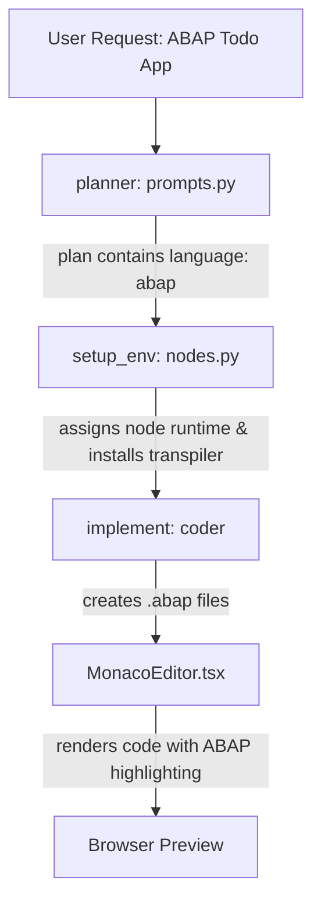

# Guide: Applied Changes for ABAP Support in `myaiagent`

We have successfully integrated native **ABAP** language support into the existing `myaiagent` workspace. The changes span the Planning Agent (prompt config), Environment Node (sandbox prep), and the Frontend Interface (code viewer).

Here is a summary of the edits applied and how they affect the build lifecycle.

---

## 📂 Summary of Changes

We modified three key files to enable planning, sandboxing, and syntax highlighting for ABAP:



### 1. `backend/agent/prompts.py`
We added `abap` as a recognized programming language option in the planner's schema rules.
* **Why:** This tells the planner model that it is allowed to construct and output project plans targeting the ABAP stack.
* **Diff:**
```diff
     "database": "postgresql" or "mongodb" or "sqlite" or "mysql" or "none",
-    "language": "javascript" or "typescript" or "python" or "java" or "go"
+    "language": "javascript" or "typescript" or "python" or "java" or "go" or "abap"
   }},
```

### 2. `backend/agent/nodes.py`
We updated the `setup_environment_node` logic so that when the agent's project plan selects `language: "abap"`, it allocates and spins up the `node` runtime in the Docker sandbox.
* **Why:** ABAP compiles and runs locally in our sandbox via the Open-ABAP transpiler, which requires Node.js/npm.
* **Diff:**
```diff
     if not runtimes_needed:
         runtimes_needed = []
-        if frontend in ('react', 'vue', 'angular', 'next', 'svelte') or language in ('javascript', 'typescript'):
+        if frontend in ('react', 'vue', 'angular', 'next', 'svelte') or language in ('javascript', 'typescript', 'abap'):
             runtimes_needed.append('node')
```

### 3. `frontend/src/components/MonacoEditor.tsx`
We registered the `.abap` file extension to maps to Monaco's built-in `'abap'` language highlighter.
* **Why:** This ensures that when the agent generates `.abap` files, they render with full, premium syntax highlighting in your browser instead of standard plain text.
* **Diff:**
```diff
 const langMap: Record<string, string> = {
     py: 'python', js: 'javascript', ts: 'typescript',
     tsx: 'typescriptreact', jsx: 'javascriptreact',
-    rs: 'rust', go: 'go', json: 'json', html: 'html', css: 'css'
+    rs: 'rust', go: 'go', json: 'json', html: 'html', css: 'css',
+    abap: 'abap'
 };
```

---

## ⚡ How to Start and Verify

Both your backend server (`uvicorn` / `main.py`) and frontend bundler (`vite` / `npm run dev`) support auto-reloading. If the services are already running, the changes will apply automatically.

If you need to start them manually:

1. **Start Backend:**
   ```bash
   cd "/media/aashikant/GAME Volume/aicode/myaiagent/backend"
   source venv/bin/activate
   uvicorn main:app --reload --host 0.0.0.0 --port 8000
   ```
2. **Start Frontend:**
   ```bash
   cd "/media/aashikant/GAME Volume/aicode/myaiagent/frontend"
   npm run dev
   ```

### Running Your First ABAP Build:
Open your browser to `http://localhost:5173`, start a new session, and input:
> *"Build a console To-Do application using the ABAP language and run it with open-abap transpiler."*

The agent will automatically plan, create the config files (`package.json`, `abap_transpile.json`, `abaplint.json`), write your `.abap` programs under `src/`, execute the transpiler, and validate the output in the console terminal!
