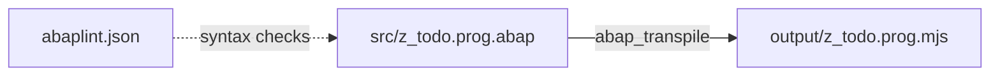

# Build and Preview Flow for ABAP Code in `myaiagent`

Since the sandbox lacks an SAP NetWeaver instance, the agent leverages **transpilation** to convert ABAP objects into standard JavaScript modules.

Depending on the prompt, the agent builds and previews the code in two different ways:

---

## 💻 Method 1: Console / CLI Preview (Standard Output)

This is used for standard reports or algorithm validation. The output is displayed directly in the user interface's bottom console window.

### The Build Step:

1. The agent calls:
   `<run>npm run build</run>`
2. This runs the command:
   `abap_transpile abap_transpile.json`
3. The transpiler analyzes `src/z_todo_app.prog.abap` using `abaplint.json` rules to ensure syntax validity.
4. It compiles the ABAP code into a ES6 JavaScript module `output/z_todo_app.prog.mjs`.

### The Execution / Preview Step:
1. The agent calls:
   `<run>npm start</run>`
2. This runs the launcher script:
   `node src/index.js`
3. `src/index.js` imports the `@abaplint/runtime` (which mimics ABAP behaviors like internal tables, structure assignments, loops, and the screen buffer) and imports the transpiled module:
   ```javascript
   import { FileManager } from "@abaplint/runtime";
   await import("../output/z_todo_app.prog.mjs");
   ```
4. The output from ABAP `WRITE:` statements is printed directly to stdout and displayed in your web UI terminal panel:
   ```text
   --- ABAP TO-DO LIST ---
   ID: 1 | Task: Learn ABAP on Node.js | Status: [ ] Pending
   -----------------------
   ```

---

## 🌐 Method 2: Web Application Preview (Live Port Preview)

This is used when you ask the agent to build a "Web To-Do App in ABAP". The agent wraps the transpiled ABAP logic in a standard Web Server, making it interactive.

### The Build Step:
1. The agent compiles the ABAP business logic `.abap` files into `.mjs` modules just like in Method 1.
2. The agent writes a standard backend server (e.g., Express.js or Fastify in `src/server.js`).
3. This server imports the transpiled ABAP file as a controller:
   ```javascript
   import { zcl_todo_controller } from "../output/zcl_todo_controller.clas.mjs";
   ```
4. The agent writes a static HTML/CSS/JS frontend (or React app) that communicates with this server via REST APIs.

### The Execution / Preview Step:
1. The agent starts the web server inside the Docker sandbox in the background:
   `<run>node src/server.js &</run>`
2. The server binds to port `3000` (or `8000`) inside the sandbox.
3. The backend maps the sandbox's port `3000` to a dynamically allocated host port (e.g. `45001`) on your local machine.
4. The agent validates that the server is alive and outputs:
   `Validation: App is running and accessible at http://localhost:45001`
5. A live **"Web Preview"** frame appears in the user interface dashboard allowing you to interact with the frontend of your ABAP-powered web application!
