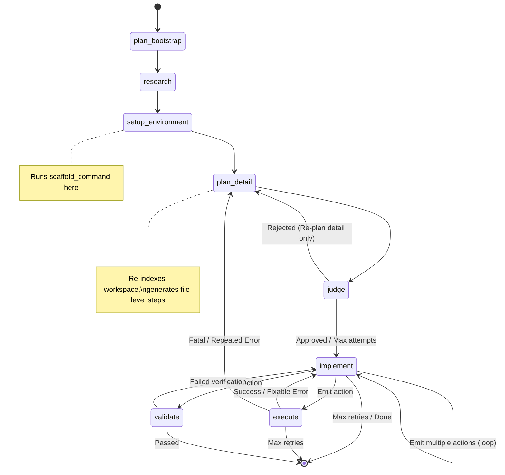

# Feature: Agent Workflow (LangGraph)

## Status
in-progress

## Goal
Multi-agent orchestration using LangGraph with Groq free API.
Agents handle code generation, execution, and ABAP-specific tasks. The state machine provides self-correction by looping execution failures back to the implementation step.

## Components
- `backend/agent/graph.py` — LangGraph state machine definition and routing
- `backend/agent/nodes.py` — Logic for individual nodes (plan_bootstrap, plan_detail, implement, etc.)
- `backend/agent/state.py` — AgentState typed dictionary schema
- `backend/agent/prompts.py` — System prompts (bootstrap, detail, implement, discuss)
- `backend/agent/state_manager.py` — State initialization, validation, and merge utilities

## Dependencies
- BidirectionalTerminalProxy (for code execution feedback)
- ContextAndMemorySystem (for providing workspace data to nodes)
- LLMAndRateLimiting (for executing the prompts)

## Architecture Flow (Two-Phase Planning)

## Node Details
1. **plan_bootstrap**: Reads context, generates project architecture (tech_stack, scaffold_command). No file-level steps.
2. **research**: Performs web searches for latest docs, framework versions, and best practices.
3. **setup_environment**: Installs runtimes/tools, runs the scaffold command (e.g., `npx -y create-vite@latest ./ --template react`).
4. **plan_detail**: Re-indexes workspace after scaffolding, generates detailed file-level implementation steps with exact paths.
5. **judge**: Critiques the plan against the real workspace. Can reject back to `plan_detail`.
6. **implement**: Reads workspace files via `WorkspaceIndexer` and generates `<write>`, `<replace>`, and `<run>` actions.
7. **execute**: Runs the commands in the Docker sandbox. Streams output.
8. **validate**: Final check to ensure the application is running (e.g., checks for active ports).

## Key State Fields
- `planning_phase`: `'bootstrap'` or `'detail'` — tracks current planning phase
- `scaffold_completed`: `bool` — whether scaffold command ran successfully
- `plan`: JSON string containing the project plan
- `workspace_summary`: Current workspace file listing

## Change Log
- 2026-06-10: Implemented two-phase planning (bootstrap → scaffold → detail plan).
- 2026-06-10: Fixed workspace path mismatch (nodes.py vs runtime.py).
- 2026-06-10: Fixed LangChain template variable escape in detail plan prompt.
- 2026-06-10: Added flowchart and node details.
- 2026-06-10: Feature doc initialized.
