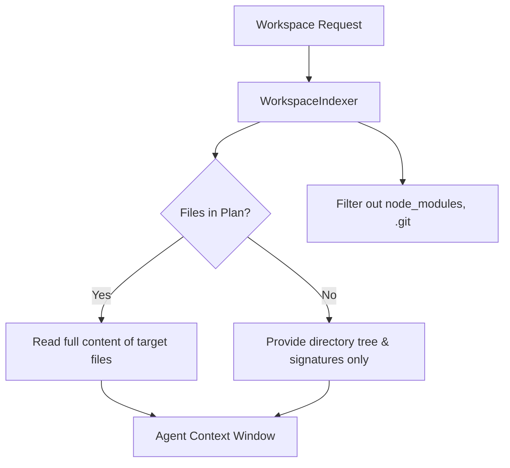

# Feature: Context and Memory System

## Status
complete

## Goal
Provide the AI agent with real-time awareness of the user's workspace, code base structure, and historical file modifications without blowing up the LLM token context limit.

## Components
- `backend/agent/workspace_indexer.py` — Analyzes directory trees and chunks files.
- `backend/agent/workspace_context.py` — Retrieves architecture guidelines and file snippets.
- `backend/agent/memory.py` — LangGraph checkpoint memory handlers.
- `backend/agent/file_history.py` — Tracks diffs and modifications over time.

## Architecture Flow

## Features
- **Dynamic File Reading:** By default, only the file tree is passed to the agent. If the agent's current plan specifies specific files to edit, the full content of those files is injected.
- **Scaffold Fallback:** If the local workspace hasn't synced yet (e.g., immediately after `npx create-vite`), a fallback mechanism directly reads file contents from the Docker container via `cat`.
- **Architectural Rules:** Injects system-wide rules (like `.coding_guidelines`) into every prompt automatically.

## Change Log
- 2026-06-10: Retrospectively documented.
