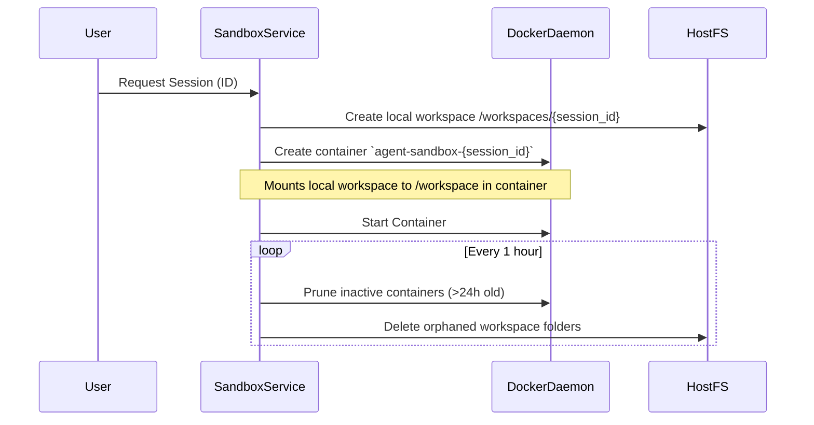

# Feature: Docker Sandbox Lifecycle

## Status
complete

## Goal
Spin up and tear down isolated Docker containers per user session
for safe code execution and isolated file management.

## Components
- `backend/services/sandbox_service.py` — Lifecycle manager
- `backend/runtime.py` — Docker connection and execution handler

## Architecture Flow

## Features
- **Volume Mounting:** Binds `backend/workspaces/{session_id}` to `/workspace` inside the container so files persist across container restarts and are available to the host IDE.
- **Auto-Cleanup:** Background tasks periodically purge stale containers to prevent resource exhaustion.
- **Port Mapping:** Dynamically allocates host ports to the container's exposed services (e.g., Vite dev server on 5173).

## Open Tasks
- [ ] Implement strict disk quota limits on Docker volumes.

## Change Log
- 2026-06-10: Added sequence diagram and detailed feature list.
- 2026-06-10: Feature doc initialized.
