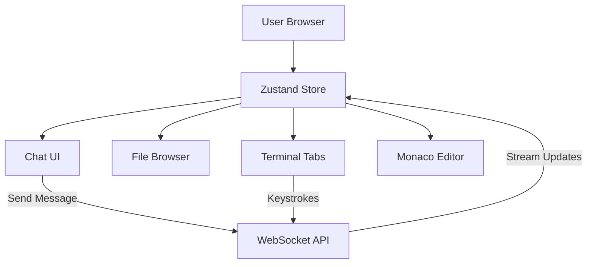

# Feature: Frontend IDE Interface

## Status
complete

## Goal
Provide a rich, React-based user interface for interacting with the AI agent, visualizing the workspace, and monitoring execution metrics.

## Components
- `frontend/src/components/MonacoEditor.tsx` — Code viewer/editor.
- `frontend/src/components/FileBrowser.tsx` — Directory tree representation.
- `frontend/src/components/Chat.tsx` — Prompting console and agent messaging.
- `frontend/src/components/ObservabilityDashboard.tsx` — Agent state and metrics.
- `frontend/src/components/Terminal.tsx` — PTY terminal and logs.

## Architecture Flow

## Features
- **Monaco Editor Integration:** Embedded VSCode-like editor for viewing and editing files in the active workspace.
- **File Locking mechanism:** Prevents the AI from overwriting files that the user is actively modifying.
- **Three-pane Terminal:** Separates `Agent Logs`, `Agent Interactive` (for CLI prompts), and `User Terminal` (for direct Docker bash access).
- **Zustand Global State:** Shares the active WebSocket connection across the Chat and Terminal components seamlessly.

## Change Log
- 2026-06-10: Retrospectively documented.
