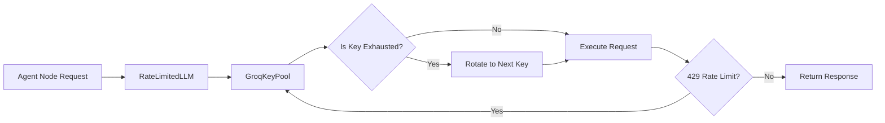

# Feature: LLM and Rate Limiting System

## Status
complete

## Goal
Manage interactions with the Groq API (or fallback providers) while strictly adhering to rate limits and token economy constraints, ensuring the agent doesn't crash during long reasoning chains.

## Components
- `backend/agent/rate_limited_llm.py` — Wrapper around LiteLLM/LangChain for backoff and retry logic.
- `backend/agent/groq_key_pool.py` — Manages multiple API keys to cycle through and avoid tier limits.

## Architecture Flow

## Features
- **Key Rotation:** Automatically round-robins between multiple Groq keys provided in the `.env` file to bypass RPM (Requests Per Minute) limits.
- **Exponential Backoff:** If all keys are exhausted, sleeps and retries rather than crashing the graph.
- **Token Tracking:** Estimates token count per request and updates internal usage metrics.

## Change Log
- 2026-06-10: Retrospectively documented.
