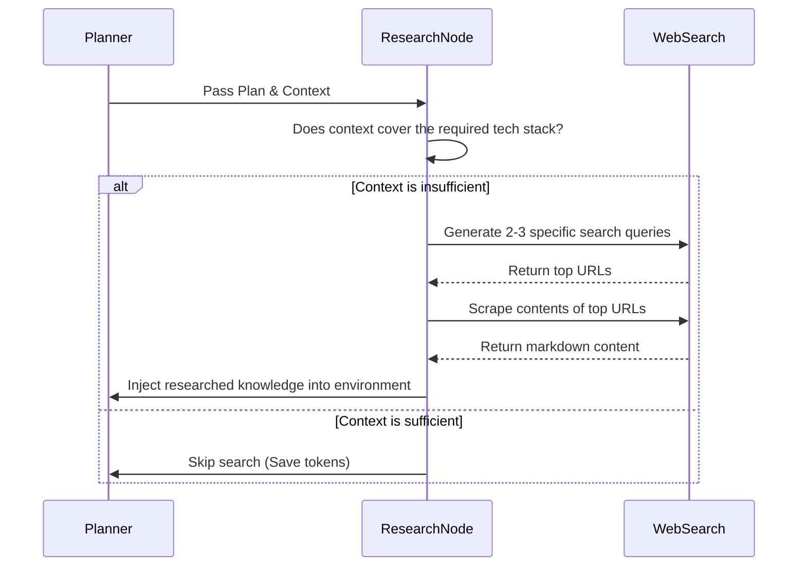

# Feature: Web Research Engine

## Status
complete

## Goal
Empower the agent to autonomously search the web for documentation, tutorials, and recent framework updates before attempting to write code for unfamiliar stacks.

## Components
- `backend/agent/web_search.py` — DuckDuckGo / Google Search API integration.
- `backend/agent/research_node.py` — LangGraph node that decides if a search is needed based on the plan.

## Architecture Flow

## Features
- **Auto-Skipping:** Analyzes existing workspace context. If the project already has boilerplate or known tech, it skips web searches to save time and tokens.
- **Concurrent Fetching:** Uses `asyncio.gather` to scrape multiple URLs simultaneously.
- **Markdown Conversion:** Uses `BeautifulSoup` to strip raw HTML and extract readable text from documentation sites.

## Change Log
- 2026-06-10: Retrospectively documented.
