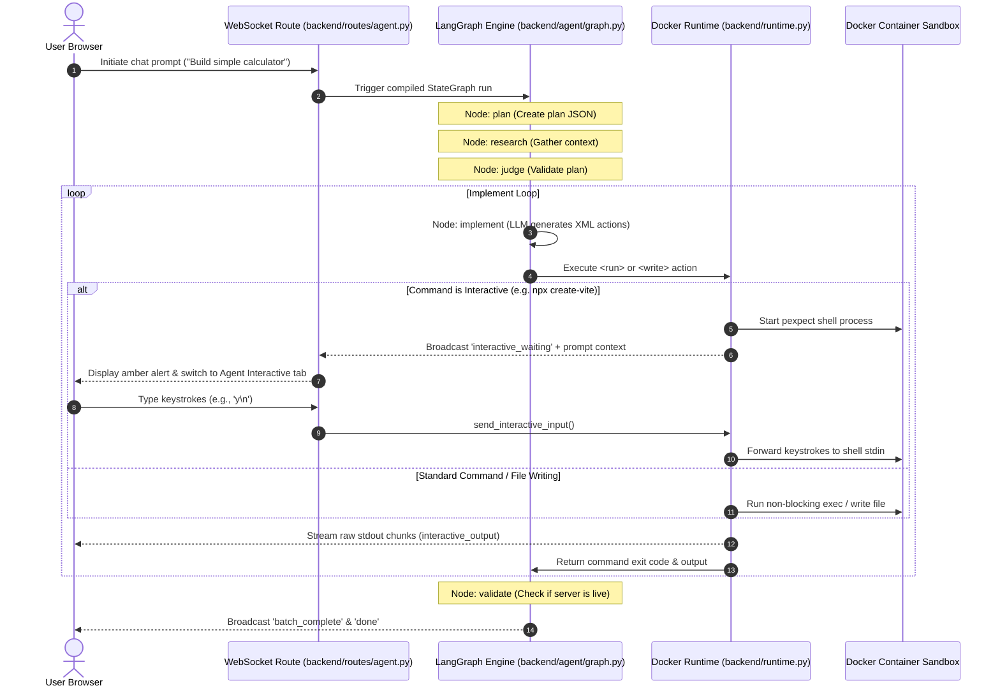

# Project Structure & Architecture Guide

This file defines the directory structure, file responsibilities, and system architecture for MyAIAgent. 

> [!IMPORTANT]
> **Rule for System Changes:** Whenever you add, rename, delete, or modify the architecture/structure of files or directories in this project, you **MUST** first update this file to reflect the changes, and then implement the structure changes.

---

## 📂 Directory Tree Layout

```
myaiagent/
├── backend/                  # Python FastAPI Backend
│   ├── agent/                # LangGraph Core Agent Logic
│   │   ├── nodes.py          # LLM Execution & Action nodes (execute, implement, etc.)
│   │   ├── prompts.py        # System and User prompts (Build, Discuss, Planner)
│   │   ├── graph.py          # StateGraph definition & routing rules
│   │   ├── state.py          # AgentState schema (messages, plan, sandbox info)
│   │   ├── schema.py         # Type specifications and Pydantic models
│   │   ├── observability.py  # Websocket logger and stream broadcaster
│   │   ├── streaming_parser.py# Parser for XML action tags (<run>, <write>, etc.)
│   │   ├── research_node.py  # Web search & research retrieval before coding
│   │   ├── judge_node.py     # Plan verification & critique node
│   │   └── ...               # Context manager, key pools, validators
│   ├── core/                 # Shared core configuration
│   │   ├── config.py         # Settings & environment variable loader
│   │   └── logger.py         # JSON structured log setup
│   ├── routes/               # API Router Handlers
│   │   ├── agent.py          # Main Websocket routes & execution handlers
│   │   ├── conversations.py  # Chat history API endpoints
│   │   └── ...               # Secrets & Settings API routes
│   ├── services/             # Domain Logic Layer
│   │   ├── sandbox_service.py# Lifecycle manager for Docker sandbox containers
│   │   └── ...               # Secret & Conversation database management
│   ├── runtime.py            # Docker Sandbox connection & command runner (pexpect)
│   ├── main.py               # FastAPI application entrypoint
│   └── requirements.txt      # Python dependencies
│
├── frontend/                 # React (Vite + TypeScript) Frontend
│   ├── src/
│   │   ├── api/              # Axios API clients & React Query keys
│   │   ├── components/       # UI Components
│   │   │   ├── Chat.tsx      # Agent Console chat interface & system alerts
│   │   │   ├── Terminal.tsx  # Tabs: Agent Logs, Agent Interactive, User Terminal
│   │   │   ├── MonacoEditor. # Embedded code editor with locking support
│   │   │   ├── FileBrowser.  # Directory tree of active sandbox
│   │   │   └── ...           # Observability Dashboard, PlanTracker
│   │   ├── hooks/
│   │   │   └── useAgentStream# WebSockets stream listener (events handler)
│   │   ├── store/
│   │   │   └── agentStore.ts # Zustand global store (shared websocket state, logs)
│   │   ├── App.tsx           # Layout, sidebar, editor, browser panels
│   │   ├── index.css         # Main Tailwind-like CSS variables & styling
│   │   └── main.tsx          # React application root entrypoint
│   └── package.json          # Node dependencies & scripts
│
├── workspaces/               # Local cache of agent files mapped by Session ID
├── Makefile                  # Automated build, lint, and run scripts
└── DEVELOPMENT.md            # Quick-start manual for environment setup
```

---

## ⚙️ How the System Works (End-to-End Flow)



---

## 🗝️ Core Technical Subsystems

### 1. The Bidirectional Interactive Proxy (`backend/runtime.py` & `routes/agent.py`)
To prevent CLI hanging on confirmations or package selections, we do not use blocking shell calls. Instead:
- **`DockerRuntime._execute_cmd_interactive`**: Starts `pexpect` inside the container. It spins up an async polling thread to continuously read output.
- **WebSocket Gateway**: Keystrokes typed in the frontend's **Agent Interactive** tab are sent over the same main agent WebSocket with `{type: "interactive_input", data}`. The backend captures this and feeds it into the queue for `pexpect` to forward to the container.

### 2. Sandbox File Lifecycle (`backend/services/sandbox_service.py`)
Every session receives a dedicated Docker container. Files are mounted and synced so that:
- Code generated by the agent is written to `/workspace` inside Docker.
- A local cache under `workspaces/{session_id}` reflects these files for directory tree browser rendering.

### 3. Shared Global Store (`frontend/src/store/agentStore.ts`)
We use **Zustand** to hold app-wide state:
- **`_agentWs`**: Retains the active WebSocket reference. This lets separate components (like `Terminal.tsx`) share the same WebSocket connection opened by the chat sidebar for sending real-time keystrokes.
- **`interactiveBySession`**: Tracks whether the active session contains a terminal command currently stalled or awaiting prompt input.
