# API-Based Deployment to SAP BTP ABAP Environment

Using the **SAP BTP Service Key** you provided, we can deploy code programmatically to your Cloud Foundry ABAP instance without manual interaction in Eclipse ADT or SAP Fiori. 

Here is how the automated API deployment flow works.

---

## 🛠️ The Architecture of API Deployment

When deploying code programmatically, we follow a 2-step HTTP execution chain:

```mermaid
sequenceDiagram
    participant Agent as AI Agent / Script
    participant UAA as XSUAA Auth Server
    participant BTP as SAP BTP ABAP Instance
    
    rect rgb(30, 30, 40)
    note right of Agent: Phase 1: Authentication
    Agent->>UAA: POST /oauth/token (client_credentials)
    UAA-->>Agent: Returns access_token
    end
    
    rect rgb(40, 30, 30)
    note right of Agent: Phase 2: Code Pull (gCTS)
    Agent->>BTP: GET /sap/bc/cts_abapvcs/repositories/{id}/pullByCommit (Bearer access_token)
    BTP-->>Agent: Fetches from Git, compiles, and activates objects
    end
```



---

## 🗝️ Phase 1: Authentication (XSUAA OAuth 2.0)

Your Service Key contains the `uaa` block, which hosts the client credentials:
* **UAA URL:** `https://c345e0fbtrial.authentication.us10.hana.ondemand.com`
* **Client ID:** `sb-acd27e89-1a1d-4d28-935e-8659a266de1c!b652961|abap-trial-service-broker!b3132`
* **Client Secret:** `56cf07bc-4639-4194-8900-1c7bc6601eb5$HRzjbtD05tm1Prr3r_MwA7hUwoeL9r125dnYWemTaAo=`

To authenticate, the deployment script executes a `POST` request to `{uaa.url}/oauth/token`:

```http
POST https://c345e0fbtrial.authentication.us10.hana.ondemand.com/oauth/token
Content-Type: application/x-www-form-urlencoded

grant_type=client_credentials&client_id=YOUR_CLIENT_ID&client_secret=YOUR_CLIENT_SECRET
```

This returns an OAuth `access_token` JWT.

---

## 🚀 Phase 2: gCTS Trigger (Git VCS Pull)

The ABAP environment has a Git-enabled Change and Transport System (gCTS) REST API service under the path `/sap/bc/cts_abapvcs/`. 

To trigger a pull, the script executes a `GET` request to the repository endpoint, passing the OAuth token as a Bearer header:

```http
GET https://bb8534dd-13b7-4042-bba9-41728e5288ac.abap.us10.hana.ondemand.com/sap/bc/cts_abapvcs/repositories/{your_repository_id}/pullByCommit?request=latest
Authorization: Bearer <your_access_token>
Accept: application/json
```

* **`{your_repository_id}`**: The name of the software component/repository as registered in the Fiori *Manage Software Components* app (e.g. `z_todo_app`).
* **`request`**: The target commit hash to deploy, or `"latest"` to fetch the head branch.

This API triggers BTP to connect to GitHub, fetch the ABAP objects, parse them, compile them, and activate them inside the `TRL` system.

---

## 🐍 3. Using the Script in Your Workspace

I have written a fully automated script at `deploy_to_btp.py` in your workspace. You or the AI Agent can run it with:

```bash
# syntax: python3 deploy_to_btp.py <repository_id> [commit_id]
python3 deploy_to_btp.py z_todo_app latest
```

The script will handle XSUAA authentication, fetch the bearer token, call the gCTS pull API, and display the JSON response from your SAP BTP Trial instance.
